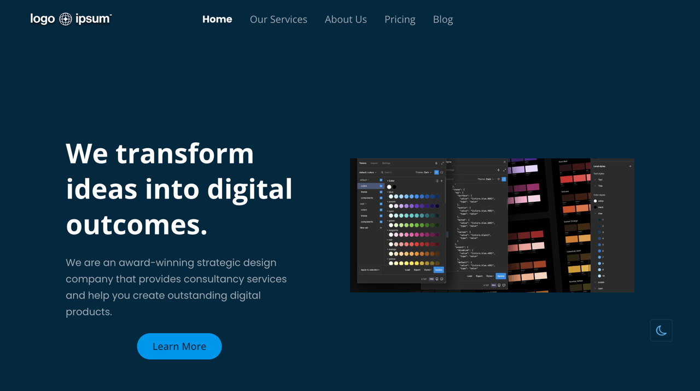
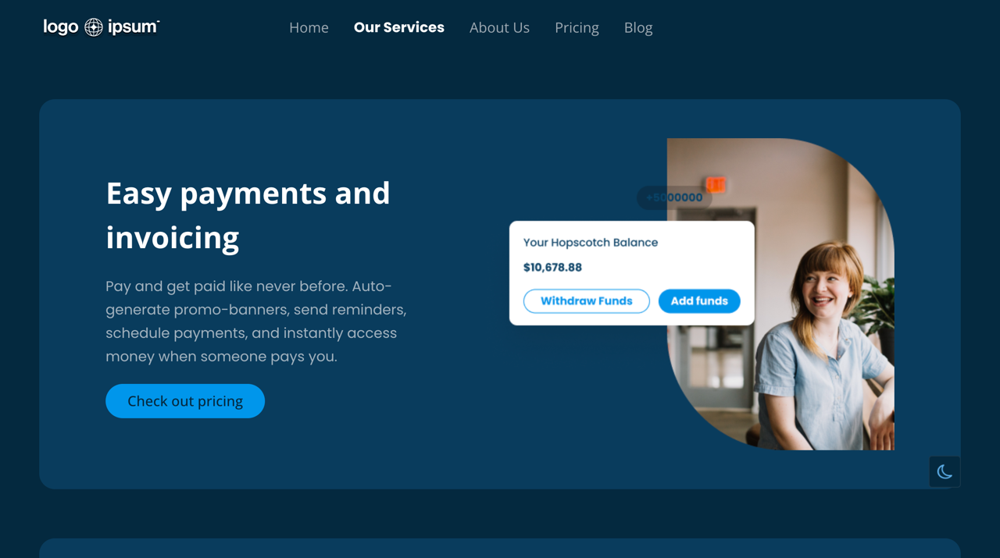
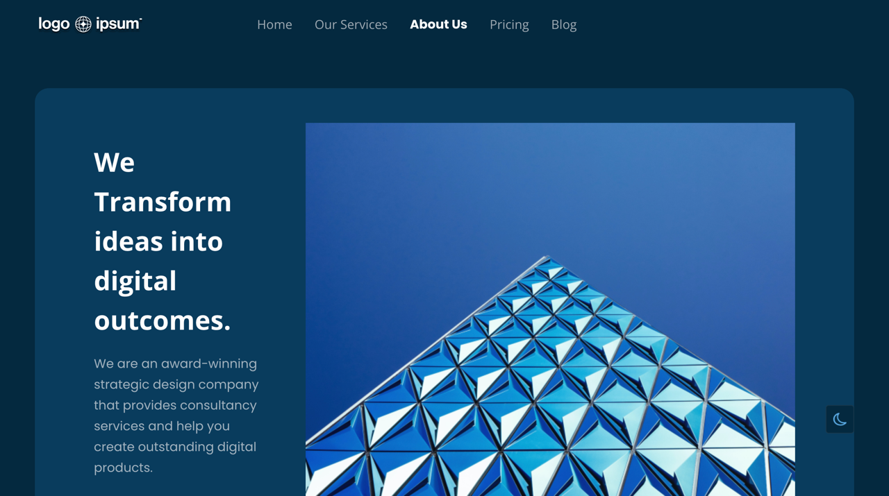
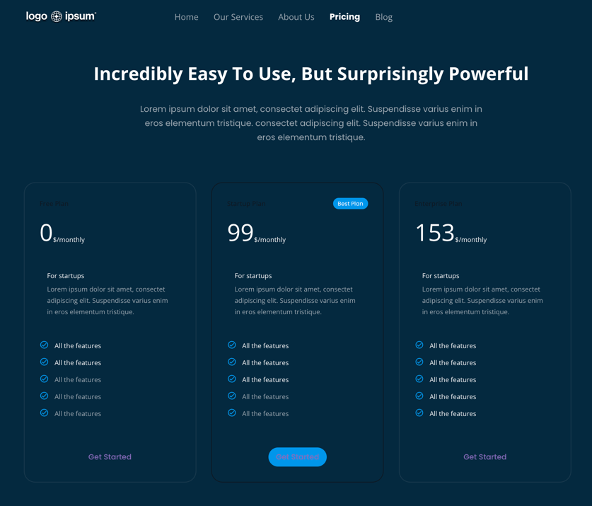
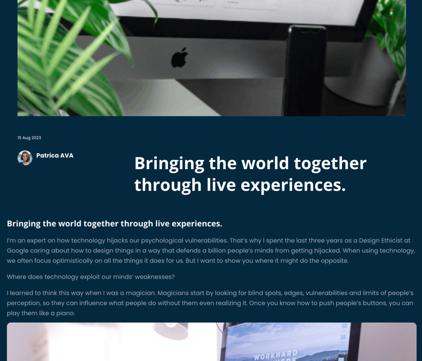

# Website Template Using `fastn`

This is template used to create a website using `fastn`. This comes up with predesigned pages. You just need to change the data and Voila.

Let's see how your future website pages going to look like.

Home page:

Service page:

About Us:

Pricing page:

Blog index page:

Article page:

